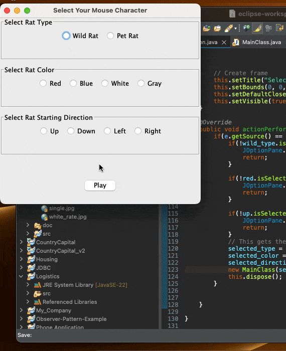

# 🐭 Artificial Mice Simulation

A Java Swing-based interactive simulation/game where you control a virtual mouse (rat) on a 7×7 grid.  
Choose your mouse's **type**, **color**, and **starting direction** — then watch it move and change the colors of the grid cells according to its unique movement rules.

---

## 🎥 Demo

---

## 📜 Features

- **Two Mouse Types**:
  - **Pet Mouse** — Turns right on gray cells, left on colored cells.
  - **Wild Mouse** — Behaves differently depending on its "tired" state and the current cell's color.
- **Customizable Mouse Appearance**:
  - Type: **Wild Rat** or **Pet Rat**
  - Color: **Red**, **Blue**, **White**, **Gray**
  - Starting Direction: **Up**, **Down**, **Left**, **Right**
- **Interactive Controls**:
  - Click the mouse icon to trigger its next move.
  - Use arrow buttons to manually control direction.
- **Toroidal Grid Movement** — Wrap-around edges so the mouse never leaves the board.
- **Dynamic Cell Colors** — Grid cells change based on mouse actions.

---

## 🛠️ How It Works

1. **Introduction Screen**  
   Choose mouse type, color, and starting direction.

2. **Game Screen**  
   The mouse appears on a random starting cell.
   - Clicking the mouse: Executes its `nextMove` logic and changes the grid.
   - Arrow buttons: Manually move the mouse in a chosen direction.

3. **Movement Rules**  
   - **PetMouse**:
     - On gray cell → turns **right**, paints it with its own color.
     - On colored cell → turns **left**, paints it gray.
   - **WildMouse**:
     - Has a "tired" state that changes its movement and painting behavior.
     - Alternates between turning and painting depending on both tiredness and cell color.

---
